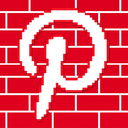

# NoPinWall

<p align="center">
  
</p>

<p align="center">
  <strong>Browse Pinterest freely without annoying login popups or scroll locks.</strong>
</p>

<p align="center">
  
  
  
</p>

---

## 🧐 The Problem

When browsing Pinterest without an account, a full-screen login modal and dimmed backdrop frequently blocks your screen and disables page scrolling.

## 🚀 The Solution

**NoPinWall** is a lightweight, zero-permission browser extension (Manifest V3) that:
- **Blocks the login popup** and background overlay before it renders.
- **Unlocks page scrolling** by resetting locked `overflow` and `position` properties on `<html>` and `<body>`.
- **Works dynamically** using a `MutationObserver` to catch and remove modals whenever you click pins or load more content.
- **Privacy-first**: Requires **zero** special permissions. Does not collect, track, or transmit any data.

---

## 📥 Installation

### Chromium Browsers (Chrome, Edge, Brave, Opera, Vivaldi)

1. **Download or Clone** this repository:
   ```bash
   git clone https://github.com/<your-username>/NoPinWall.git
   ```
   *(Or download as a ZIP and extract it to a folder).*

2. Open the Extensions manager in your browser:
   - **Chrome**: `chrome://extensions`
   - **Edge**: `edge://extensions`
   - **Brave**: `brave://extensions`
   - **Opera**: `opera://extensions`

3. Toggle on **Developer mode** (usually in the top-right corner).

4. Click **Load unpacked** (top-left).

5. Select the `NoPinWall` folder containing `manifest.json`.

6. Visit [Pinterest](https://www.pinterest.com) and browse freely!

---

## 🛠️ How It Works (Technical Overview)

1. **Zero-Flicker CSS Injection (`content.css`)**:
   Injected at `document_start` to hide modal selectors (`div[role="dialog"][aria-label="modal"]`, `[data-test-id="login-modal-redesign"]`, etc.) before paint, preventing any screen flickering.

2. **DOM Cleanup & Scroll Unlock (`content.js`)**:
   Detects and removes the modal dialog and backdrop from the DOM, and removes scroll-lock styles (`overflow: hidden`, `position: fixed`) from `<body>` and `<html>`.

3. **Dynamic Observer (`MutationObserver`)**:
   Pinterest is a Single Page Application (SPA). The observer watches for dynamically injected modals when navigating or clicking on pins.

4. **Extension Popup UI (`popup.html` & `popup.js`)**:
   Provides an active status indicator and a "Force Clean Page" button for manual triggers if needed.

---

## 📁 Project Structure

```text
NoPinWall/
├── .github/
│   └── workflows/
│       └── package.yml        # Automated release packaging
├── icons/
│   ├── icon16.png
│   ├── icon48.png
│   └── icon128.png
├── .gitignore
├── content.css                # Early CSS rule injection
├── content.js                 # DOM cleaner & scroll restorer
├── LICENSE                    # MIT License
├── manifest.json              # Extension manifest (MV3)
├── popup.css                  # Popup UI styling
├── popup.html                 # Toolbar popup HTML
├── popup.js                   # Popup interactions
└── README.md                  # Documentation
```

---

## 🤝 Contributing

Contributions, issues, and feature requests are welcome!
Feel free to check the [issues page](https://github.com/<your-username>/NoPinWall/issues).

---

## 📄 License

This project is licensed under the [MIT License](LICENSE).
